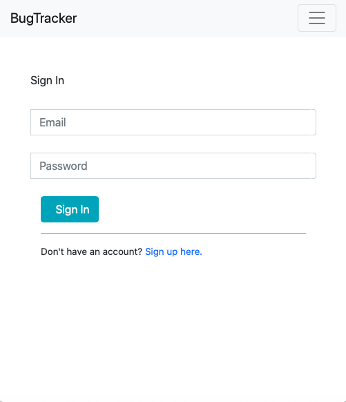
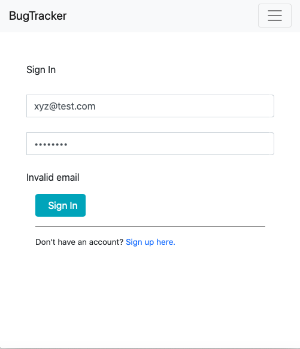
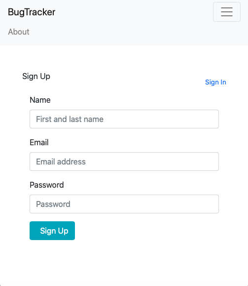
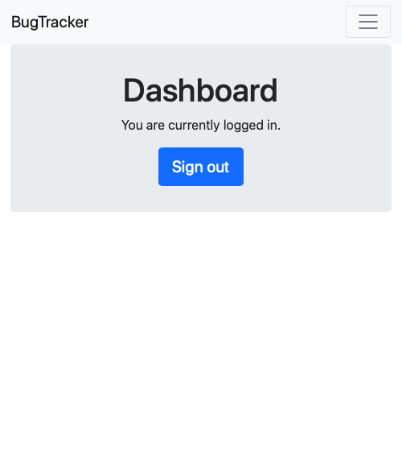
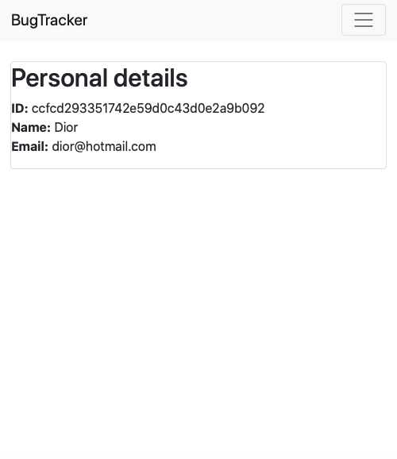

# User registration and login 
In this project, I built a Flask application that allows users to easily register and login. This template will be used in the future to build a bug tracking system.

## Resources
Flask, MongoDB, Bootstrap, JavaScript.

## Illustration
## 

## 
 
## 

## 

## 
 # user-login
# user-login

